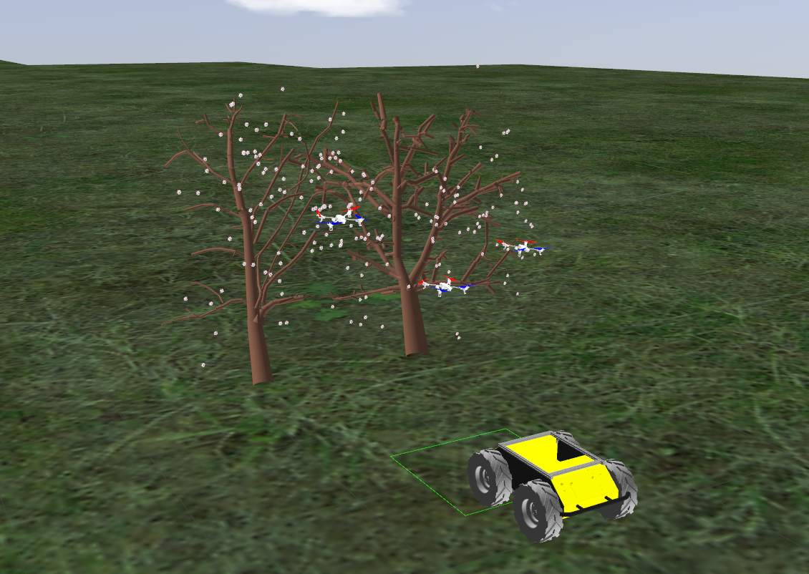
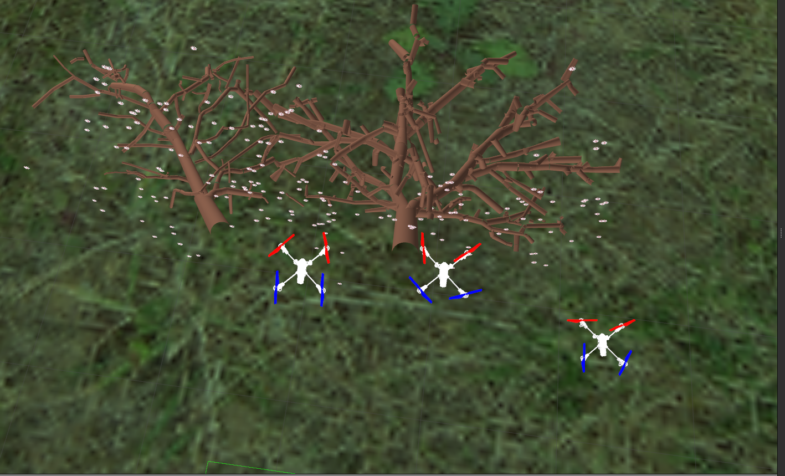
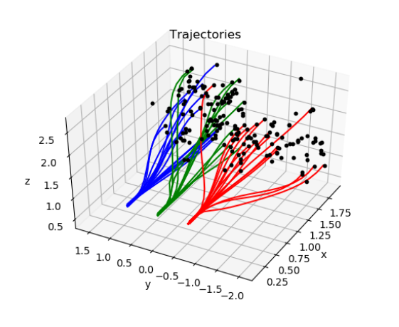
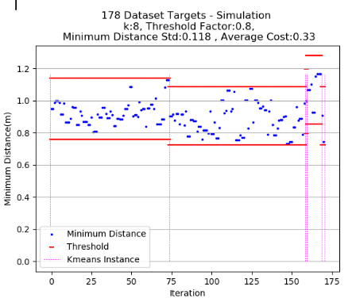
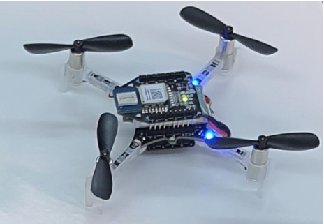

Muti Agent Drone System using RotorS simulator
===============

RotorS is a MAV gazebo simulator.

There are simulated sensors coming with the simulator such as an IMU, a generic odometry sensor, and the [VI-Sensor](http://wiki.ros.org/vi_sensor), which can be mounted on the multirotor.

Installation Instructions - Ubuntu 20.04 with ROS noetic
---------------------------------------------------------

 1. If you don't have ROS workspace yet you can do so by

 ```
 $ mkdir -p ~/catkin_ws/src
 $ cd ~/catkin_ws/src
 $ catkin_init_workspace  # initialize your catkin workspace
 $ wstool init
 $ wget https://raw.githubusercontent.com/ethz-asl/rotors_simulator/master/rotors_hil.rosinstall
 $ wstool merge rotors_hil.rosinstall
 $ wstool update
 $ git clone git@github.com:orimana2020/Multi_Agent_Drone_ROS_Simulation.git
 $ cd ~/catkin_ws
 $ catkin build
 $ source devel/setup.bash
 ```

(optional) Setting GPU
---------------------------------------------------------
Make sure to use nvidia 
 ```
glxinfo | grep OpenGL
 ```
If not: -
 ```
sudo systemctl enable gpu-manager
sudo prime-select nvidia
```
If still not showing nvidia - reboot


Running the simulation
---------------------------------------------------------

 ```
 $ cd ~/catkin_ws
 $ source devel/setup.bash
 in terminal_1 run:
 $ roslaunch rotors_gazebo drone_poll_lanch.launch 
 in terminal_2 run:
 $ rosrun drone_pollination main_ros_sim.py
 
 ```

 UGV with Three Drones in Simulation
 ---------------------------------------------------------
 
 
 
 Three Drones in Simulation
 ---------------------------------------------------------
 
 
 
 Trajectory Generation Algorithm
 ---------------------------------------------------------
 
 
 
 Target Allocation Algorithm Performance
 ---------------------------------------------------------
 
 
 
 Proof-of-Concept Experiment
 ---------------------------------------------------------
 
 
 
 CF Micro-Drone
 ---------------------------------------------------------
 
 

